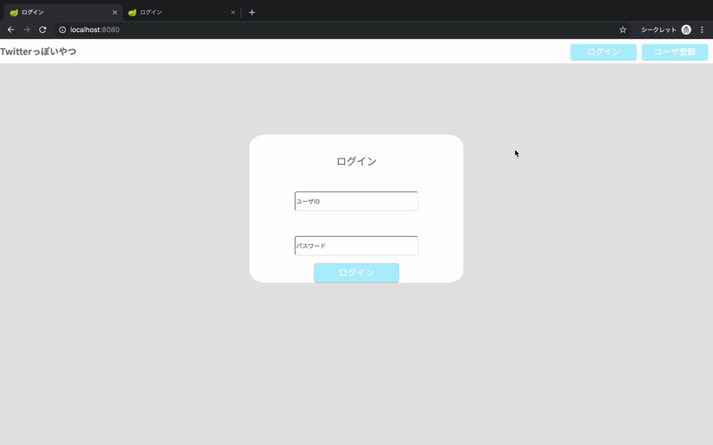

# 概要

Spring Bootを利用してTwitterっぽいものを作っています。
ざっくりと概要を以下に記載します。
全体像は下の方にある動画デモをご参照ください_(┐「ε:)_

## 利用した技術

今回は以下の技術を利用してアプリの作成を行いました。

* Spring Boot メインの実装を担うJavaフレームワーク
* Spring Security 認可・認証を担うSpringの機能
* Hibernate Tools Entityの自動生成
* Thymeleaf テンプレートエンジン
* Sass スタイルを管理するためのフレームワーク
* Vue.js 非同期処理などを行うJavaScriptフレームワーク

---

## 機能概要

現在、以下の機能を実装しています。

* ログイン機能

	* ログイン時の認証処理はSpring Securityに一任しています
	* バリデーション処理 表示部分がいまいちだから頑張りたい

* ユーザ登録機能

	* Spring Securityと組み合わせて明示的なログインを行うことでアプリ画面へスムーズに遷移できるようにしました。
	
* 投稿画面

	* 投稿 ダイアログを通じて非同期で投稿を行うことができます
	* 投稿表示 フォローユーザ・自分自身・それらが共有した投稿を表示しています
	* 投稿共有・お気に入り機能 選択した投稿について非同期で共有・お気に入り登録が行えます

* ユーザ画面
	* GETリクエストでの個々のユーザ画面アクセス ユーザIDから全てのユーザのユーザ画面へアクセスすることができ、フォローも可能です
	* プロフィール編集 ダイアログ上でユーザ情報を変更することができます 
	* お気に入り・フォロー情報表示 投稿だけでなく左記情報も表示できます(ここも非同期で頑張りたい...)

* 検索画面
	* 検索 ユーザの投稿を文字列で検索することができます(もうちょっと多機能にしたい)

---

### 残課題

まだいまいちできていない機能について備忘録として書いておきます。

* 通知機能
* メッセージ機能
* コメント機能

上記機能はVue.jsを本格的に使わないと厳しそうだから
Spring BootをAPIサーバに切り替えるぐらいの刷新が必要かも...

以下に動作デモを載せておきます。

